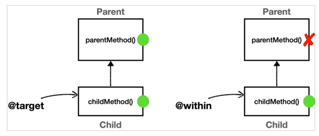

# 스프링 AOP - 포인트컷

## 포인트컷 지시자

포인트컷 표현식은 AspectJ pointcut expression 애스펙트J가 제공하는 포인트컷 표현식을 의미한다.

**포인트컷 지시자의 종류**

- `execution`: 메소드 실행 조인 포인트 매칭.
- `within`: 특정 타입 내의 조인 포인트 매칭.
- `args`: 인자가 주어진 타입의 인스턴스인 조인 포인트
- `this`: 스프링 빈 객체(스프링 AOP 프록시)를 대상으로 하는 조인 포인트
- `target`: Target 객체(스프링 AOP 프록시가 가르키는 실제 대상)를 대상으로 하는 조인 포인트
- `@target`: 실행 객체의 클래스에 주어진 타입의 애노테이션이 있는 조인 포인트
- `@within`: 주어진 애노테이션이 있는 타입 내 조인 포인트
- `@annotation`: 메서드가 주어진 애노테이션을 가지고 있는 조인 포인트 매칭
- `@args`: 전달된 실제 인수의 런타임 타입이 주어진 타입의 애노테이션을 갖는 조인 포인트
- `bean`: 스프링 전용 포인트컷 지시자. 빈의 이름으로 포인트컷 지정

## execution

```text
execution(modifiers-pattern? ret-type-pattern declaring-type-pattern?namepattern(param-pattern) throws-pattern?)

execution(접근제어자? 반환타입 선언타입?메서드이름(파라미터) 예외?)


//public(modifiers-pattern?) java.lang.String(return-type-pattern) hello.aop.member.MemberServiceImpl(declaring-type-pattern?).hello(name-pattern)(java.lang.String (param-pattern))
```

메서드 실행 조인 포인트 매칭

?는 생략 가능

'*' 같은 패턴을 지정할 수 있다.

**반환 타입, 메서드 이름: 필수**

```java
@Test
public void exactMatch(){
        //public java.lang.String hello.aop.member.MemberServiceImpl.hello(java.lang.String)
        pointcut.setExpression("execution(public String hello.aop.member.MemberServiceImpl.hello(String))");
        assertThat(pointcut.matches(helloMethod,MemberServiceImpl.class)).isTrue();
        }
```

**매칭 조건**

- 접근제어자?: public
- 반환타입: String
- 선언타입?: hello.aop.member.MemberServiceImpl
- 메서드이름: hello
- 파라미터: (String)
- 예외?: 생략

```java
@Test
public void allMatch(){
        /*
        public 생략
        String: *
        hello.aop.member.MemberServiceImpl (생략)
        hello(): *
        java.lang.String: (..)
         */
        pointcut.setExpression("execution(* *(..))");
        assertThat(pointcut.matches(helloMethod,MemberServiceImpl.class)).isTrue();
        }
```

### 파라미터 매칭

```java
@Test
public void argsMatch(){
        pointcut.setExpression("execution(* *(..))");
        assertThat(pointcut.matches(helloMethod,MemberServiceImpl.class)).isTrue();
}

@Test
public void argsMatchNoArgs(){
        pointcut.setExpression("execution(* *())");
        assertThat(pointcut.matches(helloMethod,MemberServiceImpl.class)).isFalse();
}

@Test
public void argsMatchStar(){
        pointcut.setExpression("execution(* *(*))");
        assertThat(pointcut.matches(helloMethod,MemberServiceImpl.class)).isTrue();
}

@Test
public void argsMatchAll(){
        pointcut.setExpression("execution(* *(..))");
        assertThat(pointcut.matches(helloMethod,MemberServiceImpl.class)).isTrue();
}

@Test
public void argsMatchComplex(){
        pointcut.setExpression("execution(* *(String, ..))");
        assertThat(pointcut.matches(helloMethod,MemberServiceImpl.class)).isTrue();
}
```

**execution 파라미터 매칭 규칙**

- (String): 정확하게 String타입 
- (): 파라미터 없음
- (*): 정확히 하나의 파라미터, 타입 무관
- (*, *): 정확히 두개의 파라미터, 타입 무관
- (..): 파라미터 제한 없음. 모든 타입을 허용, 개수와 무관
- (String, ...): String 타입으로 시작하고 개수와 무관한 모든 타입 허용

## within

특정 타입 내의 조인 포인트에 대한 매칭을 제한. 매칭되면 그 안의 메서드들이 자동으로 매칭된다.

## args

- `args`: 인자가 주어진 타입의 인스턴스인 조인 포인트로 매칭
- 기본 문법은 `execution`의 `args` 부분과 같다.


**execution과 args의 차이점**

- execution은 파라미터 타입이 정확하게 매칭되어야 함. execution은 클래스에 선언된 정보를 기반으로 한다.
- args는 부모 타입을 허용한다. (실제 넘어온 파라미터 객체 인스턴스를 보고 판단.)

```java
public class ArgsTest {

    Method helloMethod;

    @BeforeEach
    public void init() throws NoSuchMethodException {
        helloMethod = MemberServiceImpl.class.getMethod("hello", String.class);
    }

    private AspectJExpressionPointcut pointcut(String expression) {
        AspectJExpressionPointcut pointcut = new AspectJExpressionPointcut();
        pointcut.setExpression(expression);
        return pointcut;
    }

    @Test
    void args() {

        assertThat(pointcut("args(String)")
                .matches(helloMethod, MemberServiceImpl.class)).isTrue();

        assertThat(pointcut("args(Object)")
                .matches(helloMethod, MemberServiceImpl.class)).isTrue();

        assertThat(pointcut("args()")
                .matches(helloMethod, MemberServiceImpl.class)).isFalse();

        assertThat(pointcut("args(..)")
                .matches(helloMethod, MemberServiceImpl.class)).isTrue();

        assertThat(pointcut("args(*)")
                .matches(helloMethod, MemberServiceImpl.class)).isTrue();

        assertThat(pointcut("args(String, ..)")
                .matches(helloMethod, MemberServiceImpl.class)).isTrue();
    }

    @Test
    void argsVsExecution() {

        //Args
        assertThat(pointcut("args(String)")
                .matches(helloMethod, MemberServiceImpl.class)).isTrue();

        assertThat(pointcut("args(java.io.Serializable)")
                .matches(helloMethod, MemberServiceImpl.class)).isTrue();

        assertThat(pointcut("args(Object)")
                .matches(helloMethod, MemberServiceImpl.class)).isTrue();


        //Execution
        assertThat(pointcut("execution(* *(String))")
                .matches(helloMethod, MemberServiceImpl.class)).isTrue();

        assertThat(pointcut("execution(* *(java.io.Serializable))")
                .matches(helloMethod, MemberServiceImpl.class)).isFalse();

        assertThat(pointcut("execution(* *(Object))")
                .matches(helloMethod, MemberServiceImpl.class)).isFalse();
    }
}
```

`void args()`: args는 상위 타입의 파라미터도 매칭에 성공한다.

`void argsVsExecution()`: args와 비교했을 때 Execution은 Object, Serializable타입은 매칭에 실패하는 것을 볼 수 있다.


## @target, @within

- `@tartget`: 실행 객체의 클래스에 주어진 타입의 애노테이션이 있는 조인 포인트
- `@within`: 주어진 애노테이션이 있는 타입 내 조인 포인트

`@target(hello.aop.member.annotation.ClassAop)`
`@within(hello.aop.member.annotation.ClassAop)`

**차이**

`@target`: 인스턴스의 모든 메서드를 조인 포인트로 적용
`@within`: 해당 타입 내에 있는 메서드만 조인 포인트로 적용

> `@target`은 부모 클래스의 메서드까지 어브다이스를 다 적용하고, `@within`은 자기 자신의 클래스에 정의된 메서드에만 어드바이스를 적용한다.




## @annotation, @args

`@annotation`: 메서드가 주어진 애노테이션을 가지고 있는 조인 포인트를 매칭


```java
@Slf4j
@Import(AtAnnotationTest.AtAnnotationAspect.class)
@SpringBootTest
public class AtAnnotationTest {


    @Autowired
    MemberService memberService;

    @Test
    void success() {
        log.info("memberService proxy={}", memberService.getClass());
        memberService.hello("helloA");
    }

    @Slf4j
    @Aspect
    static class AtAnnotationAspect {

        @Around("@annotation(hello.aop.member.annotation.MethodAop)")
        public Object doAtAnnotation(ProceedingJoinPoint joinPoint) throws Throwable {
            log.info("[@annotation] {}", joinPoint.getSignature());
            return joinPoint.proceed();
        }
    }
}
```

아래와 같이 MethodAop 애노테이션을 가지고 있는 조인 포인트를 매칭한다.

```java
@ClassAop
@Component
public class MemberServiceImpl implements MemberService {
    @Override
    @MethodAop("test value")
    public String hello(String param) {
        return "ok";
    }
}
```

`@args`: 전달된 실제 인수의 런타임 타입이 주어진 타입의 애노테이션을 갖는 조인 포인트

## bean

빈의 이름으로 지정하는 스프링 전용 포인트컷 지시자.

- 스프링 빈의 이름으로 AOP 적용 여부를 지정한다. 
- `bean(orderService) || bean(*Repository)`
- `*`같은 패턴도 사용 가능하다.

```java
@Slf4j
@Import(BeanTest.BeanAspect.class)
@SpringBootTest
public class BeanTest {


    @Autowired
    OrderService orderService;

    @Test
    void success() {
        orderService.orderItem("itemA");
    }

    @Aspect
    static class BeanAspect {
        @Around("bean(orderService) || bean(*Repository)")
        public Object doLog(ProceedingJoinPoint joinPoint) throws Throwable {
            log.info("[bean] {}", joinPoint.getSignature());
            return joinPoint.proceed();
        }
    }
}
```


## 매개변수 전달

포인트컷 표현식을 사용해서 어드바이스에 매개변수를 전달할 수 있다.

`this, target, args, @target, @within, @annotation, @args`


```java
// example

@Before("allMember() && args(arg...)")
public void logArgs3(String arg) {
    log.info("[logArgs3] arg={}", arg);
}
```

- 포인트컷의 이름과 매개변수의 이름을 맞추어야 한다. 
- 타입이 메서드에 지정한 타입으로 제한된다. `String`으로 지정되어 있기 때문에 `args(arg...) -> args(String...)`

```java
@Slf4j
@Import(ParameterTest.ParameterAspect.class)
@SpringBootTest
public class ParameterTest {

    @Autowired
    MemberService memberService;

    @Test
    public void success() {
        log.info("memberService Proxy={}", memberService.getClass());
        memberService.hello("helloA");
    }

    @Slf4j
    @Aspect
    static class ParameterAspect {

        @Pointcut("execution(* hello.aop.member..*.*(..))")
        private void allMember() {

        }

        @Around("allMember()")
        public Object logArgs1(ProceedingJoinPoint joinPoint) throws Throwable {
            Object arg1 = joinPoint.getArgs()[0];
            log.info("[logArgs1]{}, arg={}", joinPoint.getSignature(), arg1);

            return joinPoint.proceed();
        }

        @Around("allMember() && args(arg, ..)")
        public Object logArgs1(ProceedingJoinPoint joinPoint, Object arg) throws Throwable {
            log.info("[logArgs2]{}, arg={}", joinPoint.getSignature(), arg);

            return joinPoint.proceed();
        }

        @Before("allMember() && args(arg, ..)")
        public void logArgs3(String arg) {
            log.info("[logArgs3] arg={}", arg);
        }

        @Before("allMember() && this(obj)")
        public void thisArgs(JoinPoint joinPoint, MemberService obj) {
            log.info("[this]{}, obj={}", joinPoint.getSignature(), obj.getClass());
        }

        @Before("allMember() && target(obj)")
        public void targetArgs(JoinPoint joinPoint, MemberService obj) {
            log.info("[target]{}, obj={}", joinPoint.getSignature(), obj.getClass());
        }


        @Before("allMember() && @target(annotation)")
        public void atTarget(JoinPoint joinPoint, ClassAop annotation) {
            log.info("[@target]{}, obj={}", joinPoint.getSignature(), annotation);
        }

        @Before("allMember() && @within(annotation)")
        public void atWithin(JoinPoint joinPoint, ClassAop annotation) {
            log.info("[@within]{}, obj={}", joinPoint.getSignature(), annotation);
        }

        @Before("allMember() && @annotation(annotation)")
        public void atAnnotation(JoinPoint joinPoint, MethodAop annotation) {
            log.info("[@annotation]{}, annotationValue={}", joinPoint.getSignature(), annotation.value());
        }
    }
}
```

- `logArgs1`: joinPoint.getArgs()[0]과 같이 매개변수를 전달
- `logArgs2`: args(arg, ..)
- `logArgs3`: `@Before`를 사용한 축약 버전. 
- `this`: 프록시 객체를 전달 받는다.
- `target`: 실제 대상 객체를 전달받는다.
- `@target`, `@within`: 타입의 애노테이션을 전달 받는다.
- `@annotation`: 메서드의 애노테이션을 전달 받는다.

