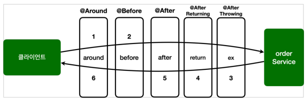

# 스프링 AOP 구현

## 예제 프로젝트

```java

@Slf4j
@Repository
public class OrderRepository {

    public String save(String itemId) {
        log.info("[orderRepository] 실행");

        if (itemId.equals("ex")) {
            throw new IllegalStateException("예외 발생!");
        }

        return "ok";
    }
}


@Slf4j
@Service
public class OrderService {
    private final OrderRepository orderRepository;

    public OrderService(OrderRepository orderRepository) {
        this.orderRepository = orderRepository;
    }

    public void orderItem(String itemId) {
        log.info("[orderService] 실행");
        orderRepository.save(itemId);
    }
}
```

## 스프링 AOP 구현

`@Aspect`를 사용해서 간단한 AOP를 구현

```java

@Slf4j
@Aspect
public class AspectV1 {

    @Around("execution(* hello.aop.order..*(..))")
    public Object doLog(ProceedingJoinPoint joinPoint) throws Throwable {
        log.info("[log] {}", joinPoint.getSignature());
        return joinPoint.proceed();
    }
}
```

`@Around` 에 사용한 포인트컷 표현식으로 인해 order 하위 클래스의 모든 메서드에 포인트컷이 적용된다.

`OrderService`, `OrderRepository`의 모든 메서드는 AOP 적용 대상이 된다.

스프링 빈으로 등록 하는 방법

- `@Bean`
- `@Component`
- `@Import`

`@Import`는 주로 설정 파일을 추가할 때 사용하지만, 스프링 빈으로 등록할 수도 있다.

```java

@Slf4j
@SpringBootTest
@Import(AspectV1.class)
public class AopTest {
    //...
}
```

## 스프링 AOP 구현2 - 포인트컷 분리

`@Around`에 포인트컷 표현식을 직접 넣어도 되고, `@Pointcut` 애노테이션을 사용해서 분리할 수 있다.

```java

@Slf4j
@Aspect
public class AspectV2 {


    //hello.aop.order 패키지와 하위 패키지
    @Pointcut("execution(* hello.aop.order..*(..))")
    private void allOrder() {
    } //pointcut signature


    @Around("allOrder()")
    public Object doLog(ProceedingJoinPoint joinPoint) throws Throwable {
        log.info("[log] {}", joinPoint.getSignature());
        return joinPoint.proceed();
    }
}
```

**@Pointcut**

- `@Pointcut`에 포인트컷 표현식을 사용
- 메서드 이름과 파라미터를 합쳐서 포인트컷 시그니쳐(signature)라 한다.
- 메서드의 반환타입은 **void**
- 위 예제에서 포인트컷 시그니쳐는 `allOrder()`
- `@Around`에서는 포인트컷 표현식이 아닌, 포인트컷 시그니쳐를 사용해도 된다.
    - @Around("allOrder()")
- 다른 애스펙트에서 사용하려면 `public`을 사용

## 스프링 AOP 구현3 - 어드바이스 추가

로그를 출력하는 기능에 추가로 트랜잭션을 적용하는 코드 추가.

진짜 트랜잭션이 아닌 기능이 동작하는 것 처럼 로그만 남기는 코드

트랜잭션 기능의 동작

- 핵심 로직 실행 직전에 트랜잭션 시작
- 로직 실행
- 문제가 없으면 커밋
- 문제가 있으면 롤백

```java

@Slf4j
@Aspect
public class AspectV3 {


    //hello.aop.order 패키지와 하위 패키지
    @Pointcut("execution(* hello.aop.order..*(..))")
    private void allOrder() {
    } //pointcut signature

    //클래스 이름 패턴이 *Service
    @Pointcut("execution(* *..*Service.*(..))")
    private void allService() {
    }


    @Around("allOrder()")
    public Object doLog(ProceedingJoinPoint joinPoint) throws Throwable {
        log.info("[log] {}", joinPoint.getSignature());
        return joinPoint.proceed();
    }

    //hello.aop.order 패키지와 하위 패키지 이면서 클래스 이름 패턴이 *Service
    @Around("allOrder() && allService()")
    public Object doTransaction(ProceedingJoinPoint joinPoint) throws Throwable {
        try {
            log.info("[트랜잭션 시작] {}", joinPoint.getSignature());
            Object result = joinPoint.proceed();
            log.info("[트랜잭션 커밋] {}", joinPoint.getSignature());
            return result;
        } catch (Exception e) {
            log.info("[트랜잭션 롤백] {}", joinPoint.getSignature());
            throw e;
        } finally {
            log.info("[리소르 릴리즈] {}", joinPoint.getSignature());
        }
    }
}
```

`allOrder()`는 `hello.aop.order`패키지와 하위 패키지를 대상으로 한다.

`allService()`는 포인트컷 타입 이름 패턴이 `*Service`를 대상으로 한다.

**타입 이름**: 클래스, 인터페이스에 모두 적용

`@Around("allOrder() && allService()")`

- 포인트컷 조합. &&, ||, ! 3가지 조합 가능
- 위 예제는 `hello.aop.order` 패캐지와 하위 패키지 이면서 타입 이름이 `*Service`인 것을 대상으로 한다.

doTransaction() 어드바이스는 OrderService에만 적용된다.

`AspectV3` 적용 후

클라이언트 -> `[doLog() -> doTransaction()]`-> `orderService.orderItem()` -> `[doLog()]` -> `[orderRepository.save()]`

orderService에는 doLog(), doTransaction() 어드바이스가 적용되고 orderRepository에는 doLog() 어드바이스 하나만 적용된다.

```text
2023-05-20 21:16:32.201  INFO 4142 --- [    Test worker] hello.aop.order.aop.AspectV3             : [log] void hello.aop.order.OrderService.orderItem(String)
2023-05-20 21:16:32.202  INFO 4142 --- [    Test worker] hello.aop.order.aop.AspectV3             : [트랜잭션 시작] void hello.aop.order.OrderService.orderItem(String)
2023-05-20 21:16:32.208  INFO 4142 --- [    Test worker] hello.aop.order.OrderService             : [orderService] 실행
2023-05-20 21:16:32.208  INFO 4142 --- [    Test worker] hello.aop.order.aop.AspectV3             : [log] String hello.aop.order.OrderRepository.save(String)
2023-05-20 21:16:32.211  INFO 4142 --- [    Test worker] hello.aop.order.OrderRepository          : [orderRepository] 실행
2023-05-20 21:16:32.212  INFO 4142 --- [    Test worker] hello.aop.order.aop.AspectV3             : [트랜잭션 커밋] void hello.aop.order.OrderService.orderItem(String)
2023-05-20 21:16:32.212  INFO 4142 --- [    Test worker] hello.aop.order.aop.AspectV3             : [리소르 릴리즈] void hello.aop.order.OrderService.orderItem(String)
```

## 스프링 AOP 구현4 - 포인트컷 참조

포인트컷을 공용으로 사용하기 위해 별도의 외부 클래스에 모아두어 사용할 수 있다. 외부에서 호출할 때는 포인트컷의 접근 제어자를 `public`으로 열어두면 된다.

```java
public class Pointcuts {

    @Pointcut("execution(* hello.aop.order..*(..))")
    public void allOrder() {
    } //pointcut signature

    //클래스 이름 패턴이 *Service
    @Pointcut("execution(* *..*Service.*(..))")
    public void allService() {
    }

    //allOrder && allService
    @Pointcut("allOrder() && allService()")
    public void orderAndService() {
    }

}


@Slf4j
@Aspect
public class AspectV4Pointcut {


    @Around("hello.aop.order.aop.Pointcuts.allOrder()")
    public Object doLog(ProceedingJoinPoint joinPoint) throws Throwable {
        log.info("[log] {}", joinPoint.getSignature());
        return joinPoint.proceed();
    }

    //hello.aop.order 패키지와 하위 패키지 이면서 클래스 이름 패턴이 *Service
    @Around("hello.aop.order.aop.Pointcuts.orderAndService()")
    public Object doTransaction(ProceedingJoinPoint joinPoint) throws Throwable {
        try {
            log.info("[트랜잭션 시작] {}", joinPoint.getSignature());
            Object result = joinPoint.proceed();
            log.info("[트랜잭션 커밋] {}", joinPoint.getSignature());
            return result;
        } catch (Exception e) {
            log.info("[트랜잭션 롤백] {}", joinPoint.getSignature());
            throw e;
        } finally {
            log.info("[리소스 릴리즈] {}", joinPoint.getSignature());
        }
    }
}
```

외부 패키지의 포인트컷을 사용하기 위해서는 패키지 명을 포함한 클래스 이름과 시그니쳐를 지정해서 사용한다.

## 스프링 AOP 구현5 - 어드바이스 순서

어드바이스는 기본적으로 순서를 보장하지 않는다. 순서를 지정하고 싶으면 `@Aspect` 적용 단위로 `org.springframework.core.annotation.@Order` 애노테이션을 적용한다.

어드바이스 단위가 아니라 클래스 단위로 적용할 수 있기 때문에, 애스펙트에 여러 어드바이스가 있다면 순서를 보장 받을 수 없다.

**애스펙트를 별도의 클래스로 분리해야 한다.**

[`doTransaction()` -> `doLog()`] 트랜잭션이 적용되게 해보자

```java

@Slf4j
@Aspect
public class AspectV4Pointcut {

    @Order(2)
    @Around("hello.aop.order.aop.Pointcuts.allOrder()")
    public Object doLog(ProceedingJoinPoint joinPoint) throws Throwable {
        log.info("[log] {}", joinPoint.getSignature());
        return joinPoint.proceed();
    }

    //hello.aop.order 패키지와 하위 패키지 이면서 클래스 이름 패턴이 *Service
    @Order(1)
    @Around("hello.aop.order.aop.Pointcuts.orderAndService()")
    public Object doTransaction(ProceedingJoinPoint joinPoint) throws Throwable {
        try {
            log.info("[트랜잭션 시작] {}", joinPoint.getSignature());
            Object result = joinPoint.proceed();
            log.info("[트랜잭션 커밋] {}", joinPoint.getSignature());
            return result;
        } catch (Exception e) {
            log.info("[트랜잭션 롤백] {}", joinPoint.getSignature());
            throw e;
        } finally {
            log.info("[리소스 릴리즈] {}", joinPoint.getSignature());
        }
    }
}
```

기존에 작성했던 `AspectV4Pointcut`에 `Order` 애노테이션을 사용하여 순서를 지정했다.

```text
 [log] void hello.aop.order.OrderService.orderItem(String)
 [트랜잭션 시작] void hello.aop.order.OrderService.orderItem(String)
 [orderService] 실행
 [log] String hello.aop.order.OrderRepository.save(String)
 [orderRepository] 실행
 [트랜잭션 커밋] void hello.aop.order.OrderService.orderItem(String)
 [리소스 릴리즈] void hello.aop.order.OrderService.orderItem(String)
```

하지만 순서에 상관없이 `log` -> `transaction` 순으로 로그가 남는다.

**`Order` 애노테이션은 클래스 단위에 적용이 가능하다.**

```java

@Slf4j
public class AspectV5Order {

    @Aspect
    @Order(2)
    public static class LogAspect {
        @Around("hello.aop.order.aop.Pointcuts.allOrder()")
        public Object doLog(ProceedingJoinPoint joinPoint) throws Throwable {
            log.info("[log] {}", joinPoint.getSignature());
            return joinPoint.proceed();
        }

    }

    @Aspect
    @Order(1)
    public static class TxAspect {

        @Around("hello.aop.order.aop.Pointcuts.orderAndService()")
        public Object doTransaction(ProceedingJoinPoint joinPoint) throws Throwable {
            try {
                log.info("[트랜잭션 시작] {}", joinPoint.getSignature());
                Object result = joinPoint.proceed();
                log.info("[트랜잭션 커밋] {}", joinPoint.getSignature());
                return result;
            } catch (Exception e) {
                log.info("[트랜잭션 롤백] {}", joinPoint.getSignature());
                throw e;
            } finally {
                log.info("[리소스 릴리즈] {}", joinPoint.getSignature());
            }
        }
    }
}
```

위와 같이 @Aspect 클래스 단위에 `@Order` 애노테이션을 적용하면 다음과 같이 순서를 보장하는 어드바이스가 실행된다.

```text
[트랜잭션 시작] void hello.aop.order.OrderService.orderItem(String)
[log] void hello.aop.order.OrderService.orderItem(String)
[orderService] 실행
[log] String hello.aop.order.OrderRepository.save(String)
[orderRepository] 실행
[트랜잭션 커밋] void hello.aop.order.OrderService.orderItem(String)
[리소스 릴리즈] void hello.aop.order.OrderService.orderItem(String)
```

> `@Order` 애노테이션은 클래스 단위에 적용해야 한다!

## 스프링 AOP 구현6 - 어드바이스 종류

**어드바이스 종류**

- `@Around`: 메서드 호출 전후에 수행. 조인포인트 실행 여부 선택, 반환 값 변환, 예외 변환 등이 가능
- `@Berfore`: 조인 포인트 실행 이전에만 실행
- `@AfterReturning`: 조인 포인트가 정상 완료후 실행
- `@AfterThrowing`: 메서드가 예외를 던지는 경우 실행
- `@After`: 조인 포인트가 정상 예외 관계없이 실행(finally)

```java

@Slf4j
@Aspect
public class AspectV6Advice {

    @Around("hello.aop.order.aop.Pointcuts.orderAndService()")
    public Object doTransaction(ProceedingJoinPoint joinPoint) throws Throwable {
        try {
            //@Before
            log.info("[트랜잭션 시작] {}", joinPoint.getSignature());
            Object result = joinPoint.proceed();
            //@AfterReturning
            log.info("[트랜잭션 커밋] {}", joinPoint.getSignature());
            return result;
        } catch (Exception e) {
            //@AfterThrowing
            log.info("[트랜잭션 롤백] {}", joinPoint.getSignature());
            throw e;
        } finally {
            //@After
            log.info("[리소스 릴리즈] {}", joinPoint.getSignature());
        }
    }

    @Before("hello.aop.order.aop.Pointcuts.orderAndService()")
    public void doBefore(JoinPoint joinPoint) {
        log.info("[before] {}", joinPoint.getSignature());
    }

    @AfterReturning(value = "hello.aop.order.aop.Pointcuts.orderAndService()", returning = "result")
    public void doReturn(JoinPoint joinPoint, Object result) {
        log.info("[return] {} return={}", joinPoint.getSignature(), result);
    }

    @AfterThrowing(value = "hello.aop.order.aop.Pointcuts.orderAndService()", throwing = "ex")
    public void doThrowing(JoinPoint joinPoint, Exception ex) {
        log.info("[ex] {} message={}", joinPoint.getSignature(), ex.getMessage());
    }

    @After(value = "hello.aop.order.aop.Pointcuts.orderAndService()")
    public void doAfter(JoinPoint joinPoint) {
        log.info("[after] {}", joinPoint.getSignature());
    }
}
```

**JoinPoint` 인터페이스의 주요 기능**

- `getArgs()`: 메서드 인수 반환
- `getThis()`: 프록시 객체 반환
- `getTarget()`: 대상 객체 반환
- `getSignature()`: 메서드에 대한 설명 반환
- `toString()`: Advice에 대한 설명 반환

**ProceedingJoinPoint` 인터페이스 주요기능**

- `proceed()`: 다음 어드바이스나 타겟 호출

추가로, 호출시 전달한 매개변수를 파라미터를 통해 전달 받을 수 있다.

스프링은 동일한 `@Aspect` 안에서 조인포인트의 우선순위를 정했다.

`@Around` -> `@Before` -> `@AfterReturning` -> `@AfterThrowing` 의 순서로 호출 되고 반대로 리턴된다.



### @Around 외에 다른 어드바이스의 존재 이유

`@Around` 하나면 모든 기능을 수행할 수 있다. 하지만 다음 코드는 치명적인 버그가 발생한다.

```java

@Slf4j
@Aspect
public class AspectV6Advice {

    @Around("hello.aop.order.aop.Pointcuts.orderAndService()")
    public Object doTransaction(ProceedingJoinPoint joinPoint) throws Throwable {
        try {
            //@Before
            log.info("[트랜잭션 시작] {}", joinPoint.getSignature());
//            Object result = joinPoint.proceed();
            //@AfterReturning
            log.info("[트랜잭션 커밋] {}", joinPoint.getSignature());
            return null;
        } catch (Exception e) {
            //@AfterThrowing
            log.info("[트랜잭션 롤백] {}", joinPoint.getSignature());
            throw e;
        } finally {
            //@After
            log.info("[리소스 릴리즈] {}", joinPoint.getSignature());
        }
    }
}
```

```text
[트랜잭션 시작] void hello.aop.order.OrderService.orderItem(String)
[트랜잭션 커밋] void hello.aop.order.OrderService.orderItem(String)
[리소스 릴리즈] void hello.aop.order.OrderService.orderItem(String)
```

실행하면 타겟을 호출하지 않아서 이후의 로직이 실행되지 않는다.

`@Around`는 항상 `joinPoint.proceed()`를 호출해야 한다.

반면에 `@Before`는 위와 같은 상황에 대해 고민하지 않아도 되기 때문에 사용할 수 있다.

즉 다른 어드바이스들은 코드에 제약을 두어 실수를 미연에 방지할 수 있다.