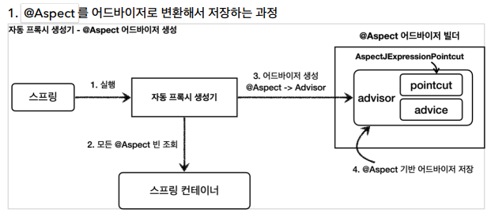

# @Aspect 프록시 - 적용

앞서 애플리케이션에 프록시를 적용하려면 포인트컷과 어드바이스로 구성되어 있는 어드바이저(`Advisor`)를 만들어서 스프링 빈으로 등록했다.

스프링은 `@Aspect` 애노테이션으로 어드바이저 생성 기능을 지원한다.

```java
@Slf4j
@Aspect
public class LogTraceAspect {

    private final LogTrace logTrace;

    public LogTraceAspect(LogTrace logTrace) {
        this.logTrace = logTrace;
    }

    @Around("execution(* hello.proxy.app..*(..))")
    public Object execute(ProceedingJoinPoint joinPoint) throws Throwable{
        TraceStatus status = null;
        try {
            String message = joinPoint.getSignature().toShortString();

            status = logTrace.begin(message);

            Object result = joinPoint.proceed();

            logTrace.end(status);
            return result;
        } catch (Exception e) {
            logTrace.exception(status, e);
            throw e;
        }
    }
}
```

- `@Aspect`: 애노테이션 기반 프록시를 적용할 때 사용
- `@Around("excution(~~~)")`: @Around에 포인트컷 표현식을 넣는다. 표현식은 AspectJ 표현식을 사용한다.
  - `@Around`의 메서드는 어드바이스가 된다.
- `ProceedingJoinPoint joinPoint`: 어드바이스에서 본 `MethodInvocation invocation`과 유사한 기능.
  - 실제 호출 대상, 전달 인자, 어떤 객체와 메서드가 호출되었는지에 대한 정보가 포함
- `joinPoint.proceed()`: target 호출

빈 후처리기의 2가지 기능

1. `@Aspect`를 보고 어드바이저로 변환해서 저장
2. 어드바이저를 기반으로 프록시를 생성



1. 실행: 애플리케이션 로딩 시점에 자동 프록시 생성기를 호출
2. @Aspect 빈 조회: 컨테이너에서 `@Aspect` 애노테이션이 붙은 스프링 빈을 모두 조회
3. 어드바이저 생성: `@Aspect` 어드바이저 빌더를 통해 `@Aspect` 정보를 기반으로 어드바이저 생성
4. 저장

> @Aspect 어드바이저 빌더
> 
> `@Aspect`의 정보를 기반으로 포인트컷, 어드바이스, 어드바이저를 생성하고 보관하는 것을 담당한다.


- 1.생성: 스프링 빈 객체를 생성 
- 2.전달:  생성된 객체를 빈 저장소에 등록하기 전에 빈 후처리기에 도달
- 3-1. Advisor 빈 조회: `Advisor`빈 모두 조회
- 3-2. @Aspect Advisor 조회: `@Aspect` 어드바이저 빌더 내부에 저장된 `Advisor`를 모두 조회
- 4.프록시 적용 대상 체크: 클래스 정보와 객체의 모든 메서드를 포인트컷에 모두 매칭한 뒤 적용 대상 체크
- 5.프록시 생성: 프록시 적용 대상이면 프록시를 생성해서 프록시를 반환
- 6.빈 등록: 반환된 객체가 스프링 빈으로 등록