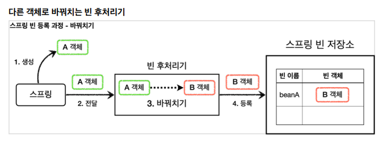
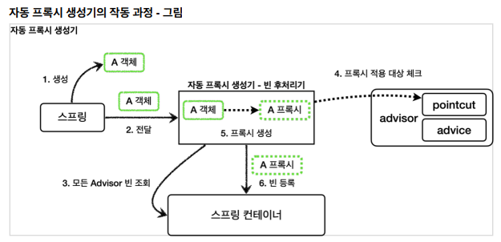

# 빈 후처리기

`@Bean`이나 컴포넌트 스캔으로 스프링 빈을 등록하면, 스프링은 대상 객체를 생성하고 스프링 컨테이너의 빈 저장소에 등록한다.

스프링이 빈 저장소에 등록할 목적으로 생성한 객체를 빈 저장소에 등록하기 전에 조작하고 싶다면, 빈 후처리기를 사용하면 된다.

## 빈 후처리기 과정



1. 생성: 스프링 빈 대상이 되는 객체를 생성 (`@Bean`, `Component`)
2. 전달: 생성된 객체를 빈 저장소에 등록하기 직전에 빈 후처리기에 전달
3. 후 처리 작업: 전달된 스프링 빈 개게를 조작하거나 다른객체로 바꿔치기
4. 등록: 빈 후처리기가 반환한 빈을 빈 저장소에 등록

## 빈 후처리기 - 예제 코드1

일반적인 스프링 빈 등록 과정

```java
public class BasicTest {

    @Test
    public void basicConfig() {
        ApplicationContext ac = new AnnotationConfigApplicationContext(BasicConfig.class);

        A a = ac.getBean("beanA", A.class);
        a.helloA();

        Assertions.assertThrows(NoSuchBeanDefinitionException.class, () -> ac.getBean(B.class));
    }

    @Slf4j
    @Configuration
    static class BasicConfig {
        @Bean(name = "beanA")
        public A a() {
            return new A();
        }
    }

    @Slf4j
    static class A {
        public void helloA() {
            log.info("hello A");
        }
    }

    @Slf4j
    static class B {
        public void helloB() {
            log.info("hello B");
        }
    }
}
```

일반적인 빈 등록

## 빈 후처리기 - 예제 코드2

```java
public class BeanPostProcessorTest {

    @Test
    public void basicConfig() {
        ApplicationContext ac = new AnnotationConfigApplicationContext(BeanPostProcessorConfig.class);

        B b = ac.getBean("beanA", B.class);
        b.helloB();

        Assertions.assertThrows(NoSuchBeanDefinitionException.class, () -> ac.getBean(A.class));
    }

    @Slf4j
    @Configuration
    static class BeanPostProcessorConfig {
        @Bean(name = "beanA")
        public A a() {
            return new A();
        }

        @Bean
        public AToBPostProcessor helloPostProcessor() {
            return new AToBPostProcessor();
        }
    }

    //...
    
    @Slf4j
    static class AToBPostProcessor implements BeanPostProcessor {
        @Override
        public Object postProcessAfterInitialization(Object bean, String beanName) throws BeansException {
            log.info("beanName={} bean={}", beanName, bean);

            if(bean instanceof A) {
                return new B();
            }
            return bean;
        }
    }
}
```

`BeanPostProcessor`를 구현한 빈 후처리기 클래스 `AToBPostProcessor`를 만들어서 빈으로 등록하면 이후에 A 객체가 B 객체로 바꿔치기 된다.

이를 이용하면 빈 객체를 프록시로 교체하는 것도 가능하다.


## 빈 후처리기 - 적용

```java
@Slf4j
public class PackageLogTracePostProcessor implements BeanPostProcessor {

    private final String basePackage;
    private final Advisor advisor;

    public PackageLogTracePostProcessor(String basePackage, Advisor advisor) {
        this.basePackage = basePackage;
        this.advisor = advisor;
    }

    @Override
    public Object postProcessAfterInitialization(Object bean, String beanName) throws BeansException {
        log.info("param beanName={} bean={}", beanName, bean.getClass());

        String packageName = bean.getClass().getPackageName();

        //프록시 적용 대상 여부 체크
        //프록시 적용 대상이 아니면(패키지가 지정한 패키지가 아니면) 원본을 그대로 진행
        if (!packageName.startsWith(basePackage)) {
            return bean;
        }

        //프록시 대상이면 프록시를 만들어서 반환
        ProxyFactory proxyFactory = new ProxyFactory(bean);
        proxyFactory.addAdvisor(advisor);

        Object proxy = proxyFactory.getProxy();
        log.info("create proxy: target={} proxy={}", bean.getClass(), proxy.getClass());
        return proxy;
    }
}
```

프록시 팩토리를 사용해서 원본 객체를 프록시로 변환한다. 이 때 advisor가 필요하기 때문에 외부에서 주입받아 사용할 수 있다.

```java
@Slf4j
@Configuration
@Import({AppV1Config.class, AppV2Config.class})
public class BeanPostProcessorConfig {

    @Bean
    public PackageLogTracePostProcessor logTracePostProcessor(LogTrace logTrace) {
        return new PackageLogTracePostProcessor("hello.proxy.app", getAdvisor(logTrace));
    }

    private Advisor getAdvisor(LogTrace logTrace) {
        NameMatchMethodPointcut pointcut = new NameMatchMethodPointcut();
        pointcut.setMappedNames("request*", "order*", "save*");

        LogTraceAdvice advice = new LogTraceAdvice(logTrace);

        return new DefaultPointcutAdvisor(pointcut, advice);
    }
}
```

빈 후처리기를 사용하면서 v1, v2, v3같은 곳의 config에서 프록시를 생성하는 코드가 설정 파일에서 필요 없게 된다.

## 스프링이 제공하는 빈 후처리기

자동 프록시 생성기 - AutoProxyCreator

build.gradle에 `implementation 'org.springframework.boot:spring-boot-starter-aop'`을 추가하면 

`AnnotationAwareAspectJAutoProxyCreator` 빈 후처리기가 빈에 자동으로 등록된다.

이 빈 후처리기는 스프링 빈으로 등록된 `Advisor`들을 자동으로 찾아서 프록시가 필요한 곳에 자동으로 프록시를 적용해준다.

`Advisor`는 `Pointcut`과 `Advice`가 이미 포함되어 있기 때문에 `Advisor`만 알고 있으면 프록시와 부가기능을 적용할 수 있다.

> `AnnotationAwareAspectJAutoProxyCreator`는 `@AspectJ`와 관련된 AOP 기능도 자동으로 찾아서 처리한다.
> 
> `Advisor`는 물론이고 `@Aspect`도 인식해서 AOP를 적용한다.



1. 생성: 스프링이 스프링 빈 대상이 되는 객체를 생성
2. 전달: 생성된 객체를 빈 저장속에 등록하기 직전에 빈 후처리기에 전달
3. 모든 Advisor빈 조회: 자동 프록시 생성기 - 빈 후처리기는 스프링 컨테이너에서 모든 `Advisor`를 조회
4. 프록시 적용 대상 체크: `Advisor`에 포함되어 있는 포인트컷을 사용해서 객체에 프록시를 적용할지 말지 판단. 객체의 클래스 정보 말고도 해당 객체의 메서드를 포인트컷에 모두 매칭한다.
5. 프록시 생성: 프록시 적용대상이면 프록시를 생성하고 반환해서 스프링 빈으로 등록
6. 빈 등록: 스프링 빈으로 등록

```java
@Configuration
@Import({AppV1Config.class, AppV2Config.class})
public class AutoProxyConfig {

    @Bean
    public Advisor advisor1(LogTrace logTrace) {
        NameMatchMethodPointcut pointcut = new NameMatchMethodPointcut();
        pointcut.setMappedNames("request*", "order*", "save*");

        LogTraceAdvice advice = new LogTraceAdvice(logTrace);
        return new DefaultPointcutAdvisor(pointcut, advice);
    }
}
```

포인트컷이 사용되는 2가지 단계

1. 프록시 적용 여부 판단 - 생성 단계
   - 자동 프록시 생성기능 포인트컷을 사용해서 생성할 필요가 있는지 판단.
   - 판단할 때 클래스, 메서드 조건을 모두 비교한다.
     - ex) OrderControllerV1은 `request()`, `noLog()`가 있고 request가 조건을 만족하기 때문에 프록시 생성
     
2. 어드바이스 적용 판단 - 사용 단계
   - 프록시가 호출되었을 때 포인트컷을 보고 어드바이스 적용 판단
   - 포인트컷 조건에 만족하면 어드바이스 호출 후 target 호출
   - 조건에 만족하지 않으면 바로 target 호출

애플리케이션을 실행하면 다음과 같은 로그들이 확인된다.

```text
EnableWebMvcConfiguration.requestMappingHandlerAdapter()
EnableWebMvcConfiguration.requestMappingHandlerAdapter() time=61ms
EnableWebMvcConfiguration.requestMappingHandlerMapping()
EnableWebMvcConfiguration.requestMappingHandlerMapping() time=7ms
```

포인트컷이 단순히 메서드 이름에 필터를 걸었기 때문에 프록시가 만들어지고 어드바이스가 적용된 것이다.

즉, 패키지에 메서드 이름까지 지정할 수 있는 정밀한 포인트컷이 필요하게 된다.

AspectJ라는 AOP에 특화된 포인트컷 표현식을 적용할 수 있다.

```java
@Configuration
@Import({AppV1Config.class, AppV2Config.class})
public class AutoProxyConfig {

    //...
    
    @Bean
    public Advisor advisor2(LogTrace logTrace) {
//        NameMatchMethodPointcut pointcut = new NameMatchMethodPointcut();
//        pointcut.setMappedNames("request*", "order*", "save*");

        AspectJExpressionPointcut pointcut = new AspectJExpressionPointcut();
        pointcut.setExpression("execution(* hello.proxy.app..*(..))");

        LogTraceAdvice advice = new LogTraceAdvice(logTrace);
        return new DefaultPointcutAdvisor(pointcut, advice);
    }
}
```

위 표현식은 패키지 이름을 기준으로 작성해서 noLog도 로그에 남는다.

```java
@Configuration
@Import({AppV1Config.class, AppV2Config.class})
public class AutoProxyConfig {

    //...
    @Bean
    public Advisor advisor3(LogTrace logTrace) {
//        NameMatchMethodPointcut pointcut = new NameMatchMethodPointcut();
//        pointcut.setMappedNames("request*", "order*", "save*");

//        AspectJExpressionPointcut pointcut = new AspectJExpressionPointcut();
//        pointcut.setExpression("execution(* hello.proxy.app..*(..))");

        AspectJExpressionPointcut pointcut = new AspectJExpressionPointcut();
        pointcut.setExpression("execution(* hello.proxy.app..*(..)) && !execution(* hello.proxy.app..noLog(..))");

        LogTraceAdvice advice = new LogTraceAdvice(logTrace);
        return new DefaultPointcutAdvisor(pointcut, advice);
    }
}
```

조합해서 사용하면 noLog에 대해 로그를 남기지 않게 할 수 있다.


프록시 자동 생성기 상황 정리

- `advisor1`의 포인트컷만 만족: 프록시 1개 생성, 프록시에 `advisor1`만 포함
- `advisor1`, `advisor2`모두 만족: 프록시 1개 생성, 프록시에 `advisor1`, `advisor2` 포함