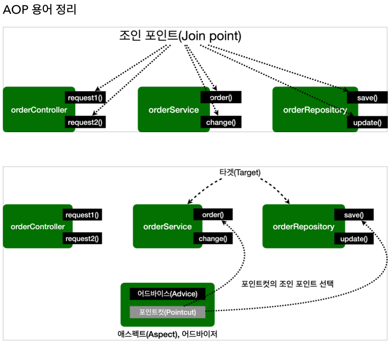

# 스프링 AOP 개념

## AOP 소개 - 핵심 기능과 부가 기능

애플리케이션 로직 = **핵심 기능** **부가 기능**

- 핵심기능: 객체가 제공하는 고유의 기능 `OrderService`의 주문 로직
- 부가기능: 핵심 기능을 보조하기 위해 제공되는 기능. 로그 추적, 트랜잭션 기능 

주문 로직을 실행하기 전에 로그 추적기능을 사용해야하면, 핵심 기능과 부가 기능이 하나의 객체 안에 섞여들어간다.

주로 부가 기능은 여러 곳에서 공통으로 사용할 수 있다.

ex) 모든 애플리케이션 호출을 로깅

이러한 부가 기능을 횡단 관심사(cross cutting concerns) 라고 한다.

부가 기능을 적용할 때 발생하는 문제

- 아주 많은 반복 발생
- 여러 곳에 존재해 중복 코드 발생과 그에 따른 수정 필요

## AOP 소개 - Aspect

### 핵심 기능과 부가 기능의 분리

부가 기능을 한 곳에서 관리하고 핵심 기능에서 분리하여 어디에 적용할지 선택 하는 기능

`Aspect`: 부가 기능과 어디에 적용할 지 선택하는 기능을 합한 하나의 모듈

Aspect는 관점이라는 뜻으로 애플리케이션을 바라보는 관점을 하나하나의 기능에서 횡단 관심사 관점으로 보는 것이다.

Aspect를 사용한 프로그래밍 방식을 관점 지향 프로그래밍(AOP, Aspect Oriented Programming)이라 한다.

## AOP 적용 방식

AOP를 사용하면 핵심 기능과 부가 기능이 분리되어 관리된다.

부가 기능 로직을 실제 로직에 추가하는 방법

- 컴파일 시점
- 클래스 로딩 시점
- 런타임 시점(프록시)

**컴파일 시점**

`.java` 코드를 컴파일러를 사용해 `.class`를 만드는 시점에 적용

단점: 컴파일 시점에 기능을 적용하려면 특별한 컴파일러가 필요하고 복잡하다.

**클래스 로딩 시점**

`.class`가 보관되는 JVM내부에 올라가기 전에 `.class` 파일을 조작 후 JVM에 로드하는 방법

단점: 운영하기 어려움

**런타임 시점**

컴파일이 끝나고 JVM에 다 올라가서 main 메서드가 실행 된 다음에 적용 

스프링 AOP가 사용하는 방식

### AOP 적용 위치

적용 가능 지점(조인 포인트): 생성자, 필드 값 접근, static 메서드 접근, 메서드 실행

프록시 방식을 사용하는 **스프링 AOP는 메서드 실행 시점에만 AOP를 적용할 수 있다.**

## AOP 용어 정리

- 조인 포인트(Join point)
  - 어드바이스가 적용될 수 있는 위치. 
  - 추상적인 개념으로 AOP를 적용할 수 있는 모든 지점
  - 스프링 AOP의 경우 항상 메서드 실행 시점이 조인 포인트
- 포인트 컷(Pointcut)
  - 조인 포인트 중 어드바이스가 적용될 위치를 선별하는 기능
  - AspectJ 표현식을 사용해서 지정한다.
- 타겟(Target)
  - 어드바이스를 받는 객체, 포인트 컷으로 결정
- 어드바이스(Advice)
  - 부가 기능
  - Around, Before, After같이 다양한 종류의 어드바이스가 있다
- 애스펙트(Aspect)
  - 어드바이스 + 포인트컷을 모듈화 한 것
  - `@Aspect`
- 어드바이저(Advisor)
  - 하나의 어드바이스와 포인트 컷
- 위빙(Weaving)
  - 포인트컷으로 결정한 타겟의 조인 포인트에 어드바이스를 적용하는 것