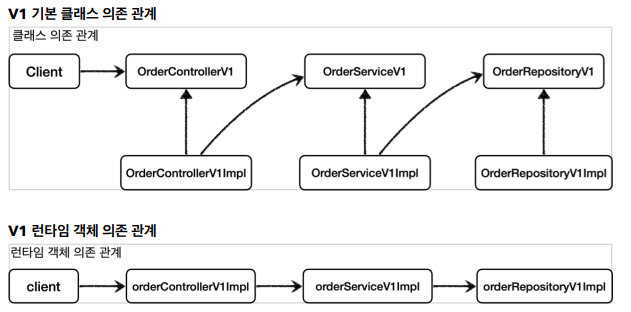

# 프록시 패턴과 데코레이터 패턴

**직접 호출**

클라이언트와 서버 개념에서 클라이언트가 서버를 직접 호출하고 처리 결과를 직접 받는 것

`Client` -> `Server`

**간접 호출**

클라이언트가 요청항 결과를 서버에 직접 요청하는 것이 아니라 대리자를 통해서 간접적으로 서버에 요청하는 것

`Client` -> `Proxy` -> `Server`

> 객체에서 프록시가 되려면 클라이언트는 서버에 요청을 한 것인지, 프록시에게 요청을 한 것인지 몰라야 한다.
>
> **서버와 프록시는 같은 인터페이스를 사용해야 함**

### 프록시의 주요 기능

- 접근 제어 (프록시 패턴)
    - 권한에 따른 접근 차단
    - 캐싱
    - 지연 로딩
- 부가 기능 (데코레이터 패턴)
    - 서버가 제공하는 기능에 더해서 부가 기능을 수행
    - ex) 요청 값, 응답 값을 중간에 변형
    - 실행 시간을 측정하거나 로그 남기기

---

## 프록시 패턴 - 예제1

```java
public interface Subject {
    String operation();
}

public class RealSubject implements Subject {
    @Override
    public String operation() {
        log.info("실제 객체 호출");
        sleep(1000);
        return "data";
    }

    private void sleep(int millis) {
        try {
            Thread.sleep(millis);
        } catch (InterruptedException e) {
            e.printStackTrace();
        }
    }
}

public class ProxyPatternClient {

    private Subject subject;

    public ProxyPatternClient(Subject subject) {
        this.subject = subject;
    }

    public void execute() {
        subject.operation();
    }
}
```

`ProxyPatternClient`는 `Subject` 인터페이스에 의존하고,`Subject`를 호출하는 클라이언트 코드

```java
public class ProxyPatternTest {

    @Test
    public void noProxyTest() {
        RealSubject realSubject = new RealSubject();
        ProxyPatternClient client = new ProxyPatternClient(realSubject);
        client.execute();
        client.execute();
        client.execute();
    }
}
```

테스트를 실행시키면 총 3초의 시간이 걸리게 된다.

만약 데이터가 변하지 않는다면 어딘가에 보관해두고 이미 조회한 데이터를 사용하는 것이 좋다. (**캐시**)

---

## 프록시 패턴 - 예제2

```java
public class CacheProxy implements Subject {

    private Subject target;
    private String cacheValue;

    public CacheProxy(Subject target) {
        this.target = target;
    }

    @Override
    public String operation() {
        log.info("프록시 호출");

        if (cacheValue == null) {
            cacheValue = target.operation();
        }
        return cacheValue;
    }
}
```

프록시도 실제 객체와 그 모양이 같기 때문에 `Subject` 인터페이스를 구현한다.

`target`: 실제 객체의 참조. 프록시가 호출하는 대상

`operation`: cacheValue에 값을 저장하고 값이 있으면 target을 호출하지 않는다.

```java
public class ProxyPatternTest {
    /**
     * client -> cacheProxy -> realSubject
     */
    @Test
    public void cacheProxyTest() {
        RealSubject realSubject = new RealSubject();
        CacheProxy cacheProxy = new CacheProxy(realSubject);
        ProxyPatternClient client = new ProxyPatternClient(cacheProxy);

        client.execute();
        client.execute();
        client.execute();
    }
}
```

`client`에 `realSubject`가 아닌 `cacheProxy`를 주입하면 `client -> cacheProxy -> realSubject` 와 같은 의존관계가 완성된다.

프록시 패턴의 핵심은 `RealSubject` 코드와 클라이언트 코드를 변경하지 않고, 프록시를 도입해서 접근 제어를 할 수 있다는 것이다.

클라이언트의 코드를 변경하지 않고 자유롭게 프록시를 넣고 뺄 수 있기 때문에 실제 클라이언트 입장에서는 프록시 객체가 주입되었는지, 실제 객체가 주입되었는지 모른다.

---

## 데코레이터 패턴

프록시 패턴이 접근제어를 위한 패턴이었다면 데코레이터 패턴은 부가 기능을 위한 패턴이다.


---

## 데코레이터 패턴 예제

```java
public interface Component {

    String operation();
}


@Slf4j
public class RealComponent implements Component {
    @Override
    public String operation() {
        log.info("RealComponent 실행");
        return "data";
    }
}

@Slf4j
public class DecoratorPatternClient {

    private Component component;

    public DecoratorPatternClient(Component component) {
        this.component = component;
    }

    public void execute() {
        String result = component.operation();
        log.info("result={}", result);
    }
}
```

클라이언트는 단순히 `Component` 인터페이스를 의존하고 `execute`를 호출하면 `operation`을 호출하고 결과를 로그로 남긴다

```java

@Slf4j
public class DecoratorPatternTest {

    @Test
    public void noDecorator() {
        Component realComponent = new RealComponent();

        DecoratorPatternClient client = new DecoratorPatternClient(realComponent);

        client.execute();
    }
}
```

데코레이터 패턴 적용 전의 객체 의존 관계는 `client` -> `realComponent`이다.

응답 값을 변형하는 프록시를 만든다.

```java

@Slf4j
public class MessageDecorator implements Component {

    private Component component;

    public MessageDecorator(Component component) {
        this.component = component;
    }

    @Override
    public String operation() {
        log.info("MessageDecorator 실행");

        String result = component.operation();
        String decoResult = "*****" + result + "*****";
        log.info("MessageDecorator 꾸미기 적용 전={}, 적용 후={}", result, decoResult);
        return decoResult;
    }

}
```

`RealComponent`의 `operation`은 단순히 data라는 문자를 반환하는데 `MessageDecorator`는 data의 앞뒤로 다른 문자를 추가해서 반환한다.

```java

@Slf4j
public class DecoratorPatternTest {

    @Test
    public void decorator1() {
        Component realComponent = new RealComponent();
        Component messageDecorator = new MessageDecorator(realComponent);
        DecoratorPatternClient client = new DecoratorPatternClient(messageDecorator);

        client.execute();
    }
}
```

위 테스트는 `client` -> `messageDecorator` -> `realComponent`의 의존관계를 만들고 호출한다.

1. MessageDecorator 실행
2. realComponent의 operation 호출
3. data 반환
4. messageDecorator에서 data의 앞뒤로 문자 추가
5. 클라이언트는 messageDecorator로부터 변형된 문자를 반환 받는다.

프록시는 또 다른 프록시를 호출할 수 있기 때문에 중간에 다른 프록시를 넣을 수 있다.

```java

@Slf4j
public class TimeDecorator implements Component {

    private Component component;

    public TimeDecorator(Component component) {
        this.component = component;
    }


    @Override
    public String operation() {
        log.info("TimeDecorator 실행");
        long startTime = System.currentTimeMillis();
        String result = component.operation();
        long endTime = System.currentTimeMillis();

        long resultTime = endTime - startTime;
        log.info("TimeDecorator 종료 resultTime={}", resultTime);
        return result;
    }
}
```

```java

@Slf4j
public class DecoratorPatternTest {

    @Test
    public void decorator2() {
        Component realComponent = new RealComponent();
        Component messageDecorator = new MessageDecorator(realComponent);
        Component timeDecorator = new TimeDecorator(messageDecorator);

        DecoratorPatternClient client = new DecoratorPatternClient(timeDecorator);
        client.execute();
    }
}
```

`client` -> `timeDecorator` -> `messageDecorator` -> `realComponent`의 의존관계를 설정하고 실행하면 시간까지 측정할 수 있다.

### 프록시 패턴 Vs 데코레이터 패턴

**의도(intent)**

프록시 패턴과 데코레이터 패턴은 생긴 모양이 거의 같다.  디자인 패턴에서는 겉모양이 아니라 패턴을 만든 의도에 따라 구분한다.

- 프록시 패턴의 의도: 다른 개체에 대한 접근을 제어 하기 위한 대리자를 제공
- 데코레이터 패턴의 의도: 객체에 추가 책임을 동적으로 추가하여, 기능 확장을 위한 대안 제공

### 정리

프록시를 사용하고 해당 프록시가 접근 제어가 목적이면 프록시 패턴이고, 새로운 기능을 추가하는 것이라면 데코레이터 패턴이 된다.

---

## 인터페이스 기반 프록시 (V1) 적용

기존에 만들었던 인터페이스와 구현체가 있는 V1의 의존관계는 다음과 같다.



여기에 로그 추적용 프록시를 만들어서 의존관계를 주입한다.

```java
public class OrderControllerInterfaceProxy implements OrderControllerV1 {

    private final OrderControllerV1 target;
    private final LogTrace logTrace;

    @Override
    public String request(String itemId) {

        TraceStatus status = null;
        try {
            status = logTrace.begin("OrderController.request()");
            String result = target.request(itemId);
            logTrace.end(status);

            return result;
        } catch (Exception e) {
            logTrace.exception(status, e);
            throw e;
        }
    }

    @Override
    public String noLog() {
        return target.noLog();
    }
}

public class OrderServiceInterfaceProxy implements OrderServiceV1 {

    private final OrderServiceV1 target;
    private final LogTrace logTrace;

    @Override
    public void orderItem(String itemId) {
        TraceStatus status = null;
        try {
            status = logTrace.begin("OrderService.orderItem()");

            target.orderItem(itemId);
            logTrace.end(status);
        } catch (Exception e) {
            logTrace.exception(status, e);
            throw e;
        }
    }
}

public class OrderRepositoryInterfaceProxy implements OrderRepositoryV1 {

    private final OrderRepositoryV1 target;
    private final LogTrace logtrace;

    @Override
    public void save(String itemId) {

        TraceStatus status = null;
        try {
            status = logtrace.begin("OrderRepository.save()");

            target.save(itemId);
            logtrace.end(status);
        } catch (Exception e) {
            logtrace.exception(status, e);
            throw e;
        }
    }
}

@Configuration
public class InterfaceProxyConfig {
    @Bean
    public OrderControllerV1 orderController(LogTrace logTrace) {
        OrderControllerV1Impl controllerImpl = new OrderControllerV1Impl(orderService(logTrace));
        return new OrderControllerInterfaceProxy(controllerImpl, logTrace);
    }

    @Bean
    public OrderServiceV1 orderService(LogTrace logTrace) {
        OrderServiceV1Impl serviceImpl = new OrderServiceV1Impl(orderRepository(logTrace));
        return new OrderServiceInterfaceProxy(serviceImpl, logTrace);
    }

    @Bean
    public OrderRepositoryV1 orderRepository(LogTrace logTrace) {

        OrderRepositoryV1Impl repositoryImpl = new OrderRepositoryV1Impl();
        return new OrderRepositoryInterfaceProxy(repositoryImpl, logTrace);
    }

}
```

> 처리 흐름
> 
> OrderControllerV1(OrderControllerInterfaceProxy)
> 
> OrderControllerV1(OrderControllerV1Impl)
> 
> OrderServiceV1(OrderServiceInterfaceProxy)
> 
> OrderServiceV1(OrderServiceV1Impl)
> 
> OrderRepositoryV1(OrderRepositoryInterfaceProxy)
> 
> OrderRepositoryV1(OrderRepositoryV1Impl)

V1의 설정과 다르게 스프링 컨테이너에 실제 객체가 아닌 프록시 객체가 빈으로 등록되어 관리된다.

스프링 컨테이너에 실제 객체가 등록되지 않기 때문에 컨테이너와는 관계가 없어지고, 프록시 객체를 통해 참조만 된다.

즉, 프록시 객체는 스프링 컨테이너가 관리하고 힙 메모리에도 올라가지만, 실제 객체는 힙 메모리에만 올라간다.

---

## 구체 클래스 기반 프록시 - 예제1

인터페이스와 구체 클래스가 있는 상황에서는 인터페이스를 구현해서 프록시를 적용했다. 인터페이스가 없는 상황에서도 적용하는 예제를 알아본다.

```java
public class ConcreteLogic {

    public String operation() {
        log.info("ConcreteLogic 실행");
        return "data";
    }
}

public class ConcreteClient {

    private ConcreteLogic concreteLogic;

    public ConcreteClient(ConcreteLogic concreteLogic) {
        this.concreteLogic = concreteLogic;
    }

    public void execute() {
        concreteLogic.operation();
    }
}

public class ConcreteProxyTest {

    @Test
    public void noProxy() {
        ConcreteLogic concreteLogic = new ConcreteLogic();

        ConcreteClient client = new ConcreteClient(concreteLogic);
        client.execute();
    }
}
```

프록시 없이 클라이언트가 `concreteLogic`의 `execute`를 호출하는 코드이다.

`client` -> `concreteLogic`의 의존관계를 갖고 있는 상황

---

## 구체 클래스 기반 프록시 - 예제2

자바의 다형성을 활용하면 인터페이스를 구현하든 클래스를 상속하든 상위 타입만 맞으면 프록시를 만들 수 있다.

```java

@Slf4j
public class TimeProxy extends ConcreteLogic {

    private ConcreteLogic concreteLogic;

    public TimeProxy(ConcreteLogic concreteLogic) {
        this.concreteLogic = concreteLogic;
    }

    @Override
    public String operation() {
        log.info("TimeDecorator 실행");
        long startTime = System.currentTimeMillis();

        String result = concreteLogic.operation();

        long endTime = System.currentTimeMillis();
        long resultTime = endTime - startTime;

        log.info("TimeDecorator 종료 resultTime={}", resultTime);
        return result;
    }
}

public class ConcreteProxyTest {

    @Test
    void addProxy() {
        ConcreteLogic concreteLogic = new ConcreteLogic();
        TimeProxy timeProxy = new TimeProxy(concreteLogic);
        ConcreteClient client = new ConcreteClient(timeProxy);
        client.execute();
    }
}
```

`client`에 `timeProxy`를 주입하는데, 다형성에 의해서 `ConcreteLogic` 타입의 하위 클래스 까지 할당이 가능하기 때문이다.

위와같이 상속을 통하면 프록시를 적용할 수 있다.

---

## 구체 클래스 기반 프록시 적용

```java
public class OrderRepositoryConcreteProxy extends OrderRepositoryV2 {

    private final OrderRepositoryV2 target;
    private final LogTrace logTrace;

    public OrderRepositoryConcreteProxy(OrderRepositoryV2 target, LogTrace logTrace) {
        this.target = target;
        this.logTrace = logTrace;
    }

    @Override
    public void save(String itemId) {
        TraceStatus status = null;

        try {
            status = logTrace.begin("OrderRepository.save()");
            target.save(itemId);
            logTrace.end(status);
        } catch (Exception e) {
            logTrace.exception(status, e);
            throw e;
        }
    }
}
```

위와같이 인터페이스가 아닌 구체 클래스를 상속받아서 프록시를 만든다. Controller, Service도 마찬가지

> `OrderRepositoryV2`는 의존관계가 설정되지 않기 때문에 문제가 없지만 `OrderControllerV2, OrderServiceV2`의 경우엔 각각 service와 repository와 의존관계를
> 맺는다.
> 클래스를 상속받기 때문에 상위 클래스의 `super()`로 생성자를 호출해야 한다. 기본 생성자가 없기 때문에 super(...)를 이용해 호출해야 하지만 프록시의 경우 상위 클래스의 기능을 사용하지 않기 때문에
> super(null)을 사용해도 된다.

```java

@Slf4j
@RequestMapping
@ResponseBody
public class OrderControllerV2 {
    private final OrderServiceV2 orderService;

    public OrderControllerV2(OrderServiceV2 orderService) {
        this.orderService = orderService;
    }

    //...

}


public class OrderControllerConcreteProxy extends OrderControllerV2 {

    private final OrderControllerV2 target;
    private final LogTrace logTrace;

    public OrderControllerConcreteProxy(OrderControllerV2 target, LogTrace logTrace) {
        super(null);
        this.target = target;
        this.logTrace = logTrace;
    }
    //...
}
```

---

## 인터페이스 기반 프록시와 클래스 기반 프록시

프록시를 사용해서 원본 코드를 변경하지 않고 LogTrace기능을 적용할 수 있었다.

### 인터페이스 기반 프록시 vs 클래스 기반 프록시

- 인터페이스가 없어도 클래스 기반으로 프록시를 사용할 수 있다.
- 클래스 기반 프록시는 해당 클래스에만 적용
  - 인터페이스 기반 프록시는 인터페이스만 같으면 모든 곳에 적용
- 클래스 기반 프록시는 상속을 사용한다.
  - 부모 클래스의 생성자를 호출해야함
  
프록시를 사용해서 로그 추적기를 적용했지만, 프록시 클래스가 하는 일은 `LogTrace`를 사용하는 같은 로직인데 적용해야 하는 클래스마다 프록시를 만들어 적용하는 문제가 있다.

이런 문제는 **동적 프록시 기술**이 해결해준다. 
